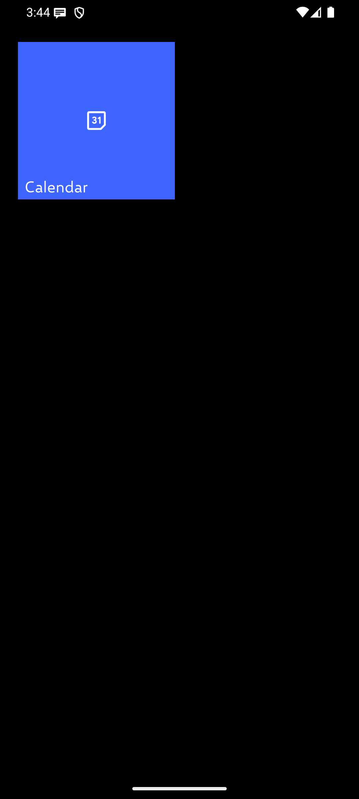
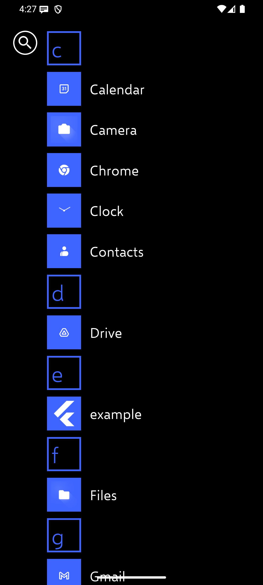
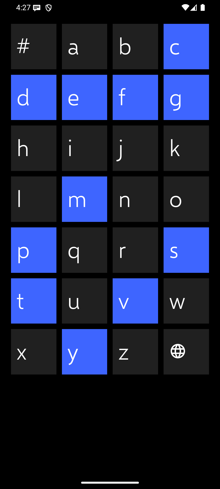
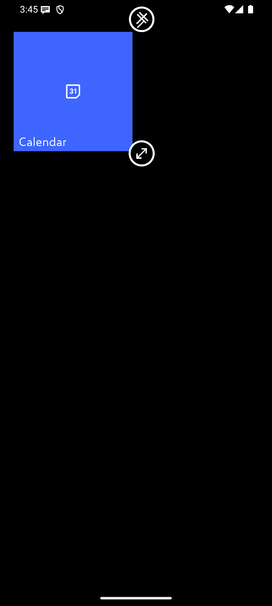
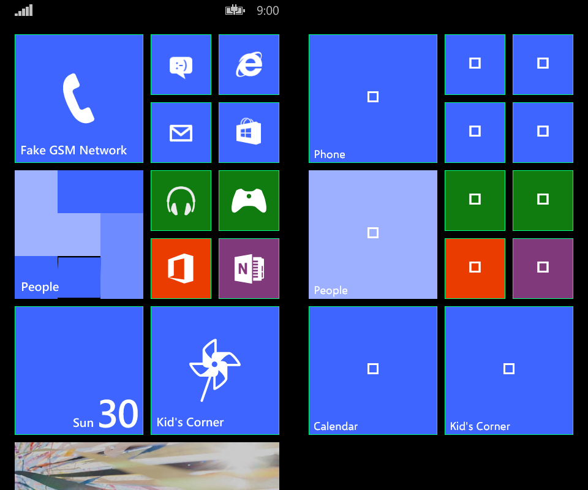
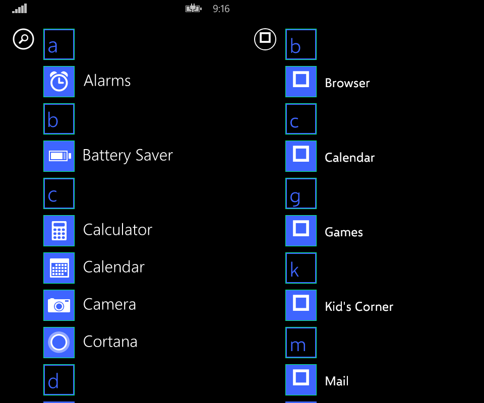
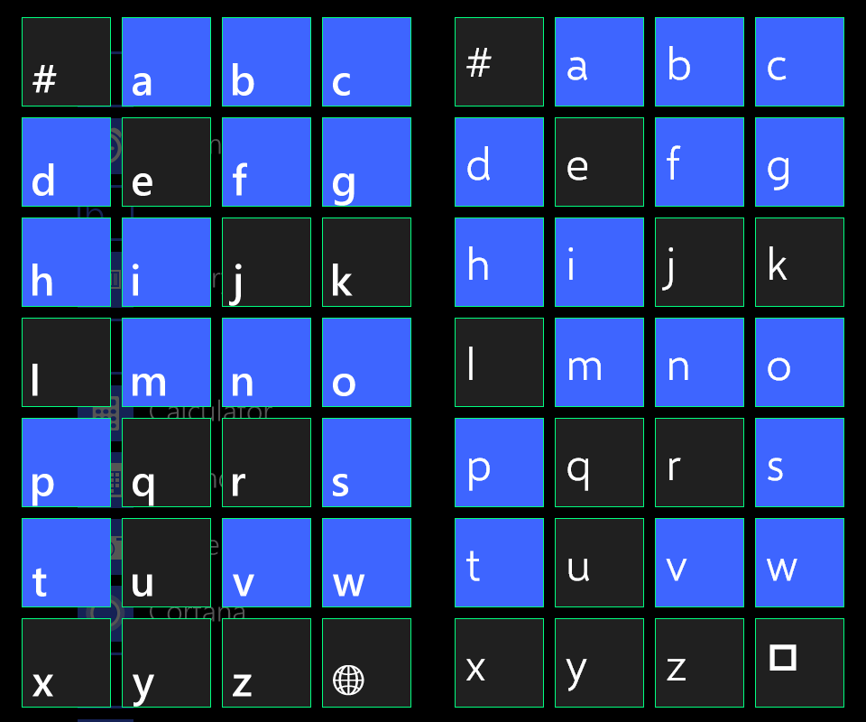
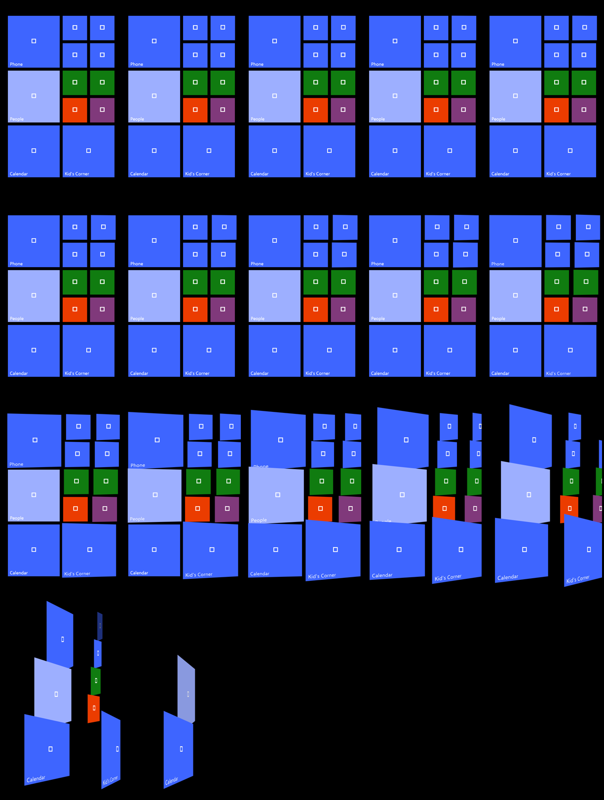

# Launcher UI fidelity evidence

This bundle records the first Metrophone integration of the launcher primitives
from `wp_pivot_flutter` 2.3.0 (package merge revision `72a8b6a`). It preserves
both the real Android path and a deterministic 480×800 comparison candidate.

## Final Android runtime

Device: Android API 35 `sdk_gphone64_x86_64` emulator, 1080×2400, density 420.

| Start | Apps | Alphabet | Tile edit |
| --- | --- | --- | --- |
|  |  |  |  |

- [Full launcher-to-Calendar walkthrough](round-02/walkthrough.mp4)
- [Walkthrough contact sheet](round-02/walkthrough-contact-sheet.png)

Round 01 is deliberately retained as correction evidence: it exposed an
unscaled Start top offset. Round 02 shows the corrected runtime. The initial
`start.png` in each round caught the launch splash; `start-settled.png` is the
resting launcher state.

Round 03 is the final Android polish recapture for the app list and alphabet:
installed icons are settled, Search uses the WP outlined circle, the alphabet
honors the Android status inset, and its final cell uses a vector globe. Its
Start frame represents the intentionally empty post-integration-test state, so
the populated Round 02 Start remains the representative runtime image.

## Held-out static comparisons

Each comparison places the Windows Phone emulator frame and Metrophone render
side by side. The machine-readable report measures inclusive flat-color bounds.

| Start | Apps | Alphabet |
| --- | --- | --- |
|  |  |  |

Results: Start 11/11, app list 10/10, alphabet 28/28; every measured candidate
edge is exact at 480×800. The separate 1080×2400 runtime check has a maximum
one-physical-pixel difference after width scaling.

## Motion evidence

- [Deterministic launch exit at 60 fps-equivalent sampling](deterministic/launch-exit.mp4)
- [Native/Flutter qualitative exit pose](comparisons/launch-exit-side-by-side.png)
- [Capture manifest](deterministic/manifest.json)

The 19 frames are sampled every 16.667 ms from the shipping launcher widgets.
They verify tile ordering, the 280 ms exit state, and that the Android launch
callback waits for the scene exit. The native/Flutter pair is illustrative,
not time-registered: the WP emulator source cannot qualify an exact duration or
curve, and the Android screen recording is behavior evidence rather than a
physical-latency measurement.

## Audit trail and limits

- [Evidence hashes and measured totals](summary.json)
- [Library source snapshot](audit/lib-final.json)
- [Test source snapshot](audit/test-final.json)
- [Capture-tool source snapshot](audit/tool-final.json)

The reference includes Microsoft system artwork that is not redistributed.
Metrophone renders installed Android app icons; the deterministic fixture uses
generic fallback marks. Static reports intentionally make no typography, icon,
motion, runtime, or physical-latency claim.
